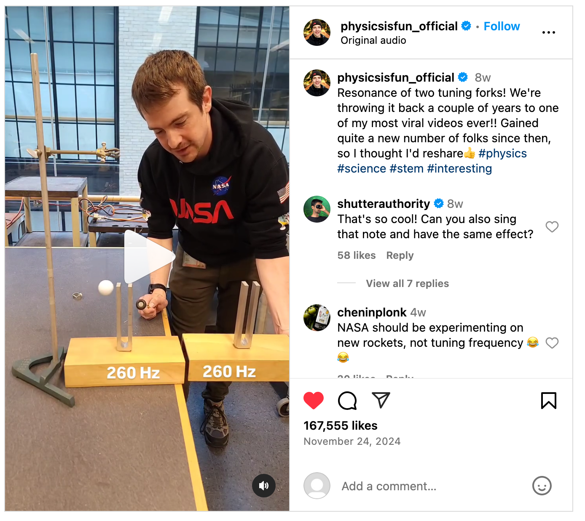
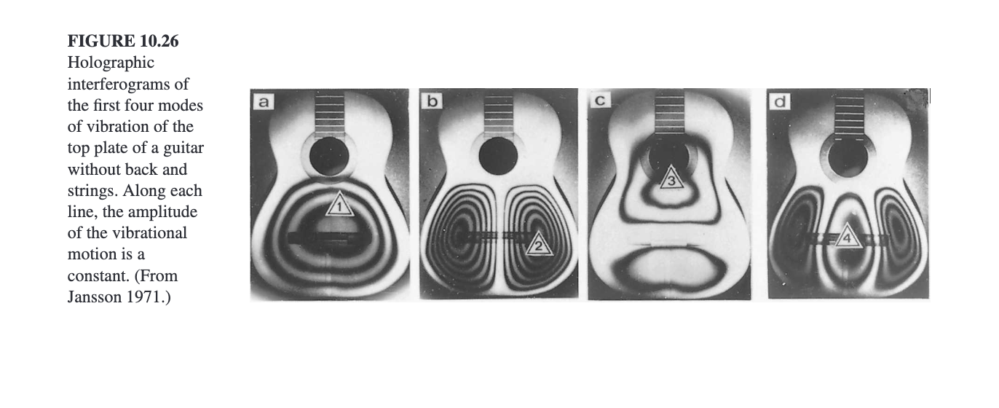
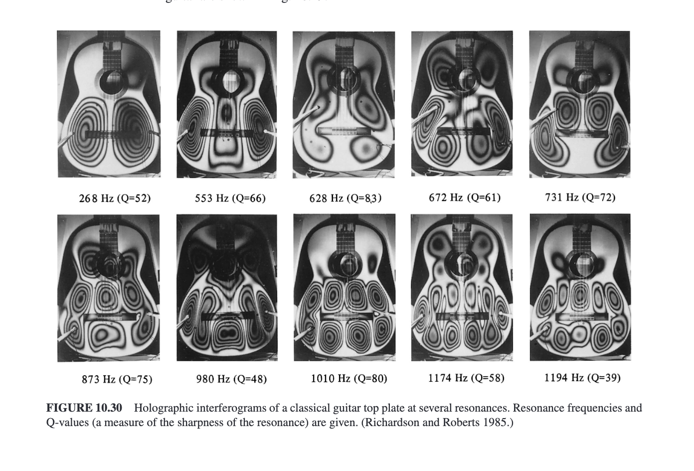

# Exploring the Science of Sound and Musical Instruments with Hands-On Activities for an Exhibition at the MIM

## Requirements: 
1. Exhibitions need to be engaging, nurture curiosity, and appeal to a wide range of audiences.
2. Exhibitions must be robust enough to handle lots of use, and not be easy to remove
3. How to handle the potential cacophony?
4. Can the exhibits be added over time, like instruments in the collection?
5. Exhibitions will be low-cost, made by volunteers until grant funding is identified and secured

## Potential Areas and Exhibit Ideas

### Resonate Frequency and Waves

[Singing Plates - Standing Waves on Chladni Plates](https://www.youtube.com/watch?v=wYoxOJDrZzw&list=PLO82UpmzB2cQ3YOLh8Wdshea_QF4CGNWF&index=3&t=44s) 

[Visualizing Waves with A Balloon, Mirror and a Laser](https://www.youtube.com/watch?v=C-V1uXeyGmg&t=223s) 

### Sympathetic Resonance

[View on Instagram](https://www.instagram.com/reel/DCwUgTXJLvY/?utm_source=ig_web_copy_link)

### Modes of Vibration, Timbre and How Shape Effects Sound

### Idiophones, Aerophones, Membranophones, Chordophones

### Resonators and Radiators

### Tuning Systems and Pitch Layouts

